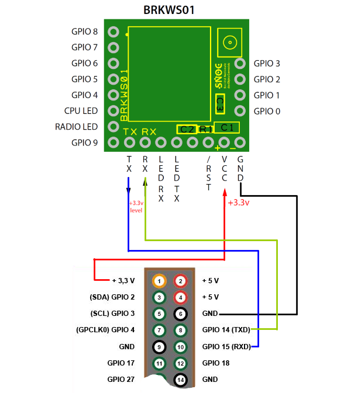

IoThings Raspberry Pi Library for
Wisol WSSFM10 Module
==============================================================

Here is all the code you need to use this module

Feel free to fork, or submit any improvements via a pull request

# Usage
## Pin connection

## Command line interface
Execute the python program like this: `python main.py 012345`